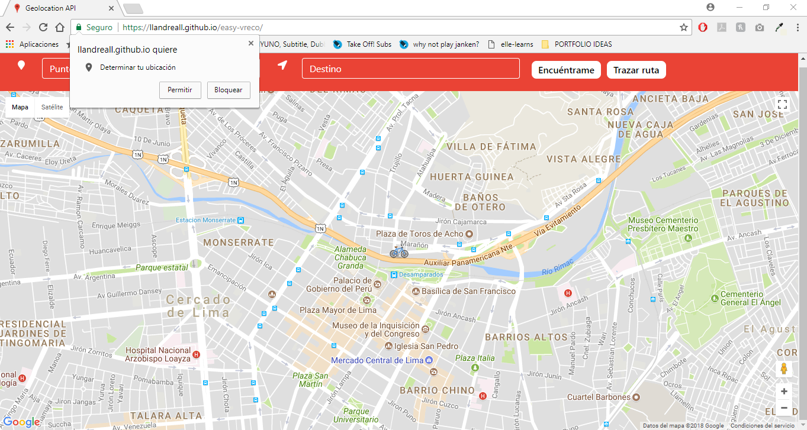

# EASY-VRECO

* **Track:** _Common Core_
* **Curso:** _CONSTRUYE UNA SINGLE PAGE APP (SPA) MULTI-USUARIO CONSUMIENDO DATA REMOTA._
* **Unidad 2:** _¿Qué hay de nuevo en HTML5?_
* **Integrantes:** _Andrea Telleria, Yosseline Apcho, Yolanda Ventura._

***

## Objetivo:

- Aprender sobre el uso de la API de 'Geolocation'.

***

## Geolocation:

- La API de geolocalización permite al usuario compartir su ubicación a las aplicaciones web si así lo desea.
- Por razones de privacidad, al usuario se le pide que confirme el permiso para proporcionar información de ubicación.

***

## Requisitos mínimos:

- Crear una página web responsive, con un maquetado apto para la ejecución de la API.
- Incorporar un mapa en la página web.
- La web deberá contar con dos botones y dos inputs:
  * El primero, será para localizar al usuario; y al darle click, deberá mostrar en el mapa su lugar de ubicación. 
  * El segundo botón, éste deberá trazar una ruta con los datos que  el usuario ingreso en los inputs.
- Autocompletado de inputs.

## Extra:

- El marcador default de Google fue cambiado, por una bicicleta (imagen en formato png para una mejor vista).

***

## Vista Desktop:

## Vista Mobile:

## Distribucción de trabajo:

+ Andrea busqueda de la API.
+ Jossy enmaquetado y funcionabilidad.
+ Yolanda cambio de es5 a es6.
* Constante comunicación en el grupo.
* Trabajando y siempre buscando la mejora del producto.

## Herramientas usadas:
- Sistema grillas.
- Bootstrap (Framework css).
- Javascript 6.
- API de Geolocation.
- CSS3.
- HTML5.
* **Integrantes:** 
+ Andrea Telleria.
+ Yosseline Apcho.
+ Yolanda Ventura.